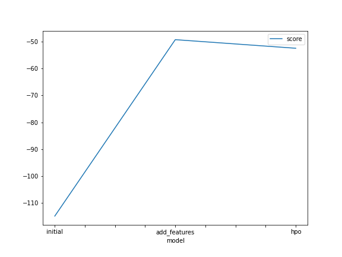
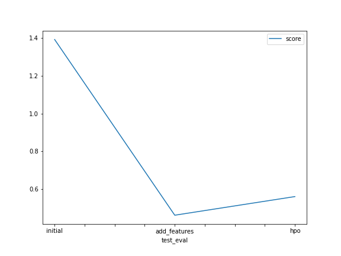

# Report: Predict Bike Sharing Demand with AutoGluon Solution

#### Fábio Ueno

## Initial Training

### What did you realize when you tried to submit your predictions? What changes were needed to the output of the predictor to submit your results?

Since Kaggle requires everything to be at least zero, I had to update negative
values to zero. And that makes sense, because we're predicting the demand of
bike sharing and there should be no negative demand.

### What was the top ranked model that performed?

I failed to optimize further than the second atempt, i.e. the best model was the
one with more features (hour, day, month, and categorical ones).

## Exploratory data analysis and feature creation

### What did the exploratory analysis find and how did you add additional features?

As seasons are stores as integers, the students were required to change its type
to categorical. Also, the `datetime` feature was split into `month`, `day` and
`hour`, to create additional features and improve the training performance.

### How much better did your model preform after adding additional features and why do you think that is?

The difference between the first version and the second, with additional
features, was huge. It went from the massive score of 1.39 to 0.46. A simple
change like that can drastically improve the model's performance.

## Hyperparameter tuning

### How much better did your model perform after trying different hyper parameters?

Actually, it only got worse. I tried to drop some features like `temp` and
`holiday`, because they have high correlation with `atemp` and `workingday`, but
got a worse performance. Also, I tuned lots of parameters from the different
algorithms, but none was successful.

### If you were given more time with this dataset, where do you think you would spend more time?

More feature engineering, perhaps the day of the week could give more insights.
Also, increasing the training period, and tuning a bit more.

### Create a table with the models you ran, the hyperparameters modified, and the kaggle score.

|Model|Depth|Learning Rate|# Estimators|Score|
|:---:|:---:|:-----------:|:----------:|:---:|
|Initial|Default|Default|Default|Default|1.39130|
|Add Features|Default|Default|Default|0.46272|
|HPO|[2, 5, 10, 20, 50, 100]|[0.001, 0.05, 0.01, 0.5, 0.1]|[10, 100, 1000, 10000]|0.56121|

### Create a line plot showing the top model score for the three (or more) training runs during the project.

### Create a line plot showing the top kaggle score for the three (or more) prediction submissions during the project.

## Summary

This first capstone project of this Nanodegree made us apply a lot of knowledge
into practice. Doing some data analysis and feature engineering, we're able to
improve our model's performance by a ton. Tuning the hyperparameters was the
second challenge. With too many parameters to change and endless possibilities,
I ended up with a worse model than with no parameters tuned, but I'm convinced
that spending more time can show better results.
